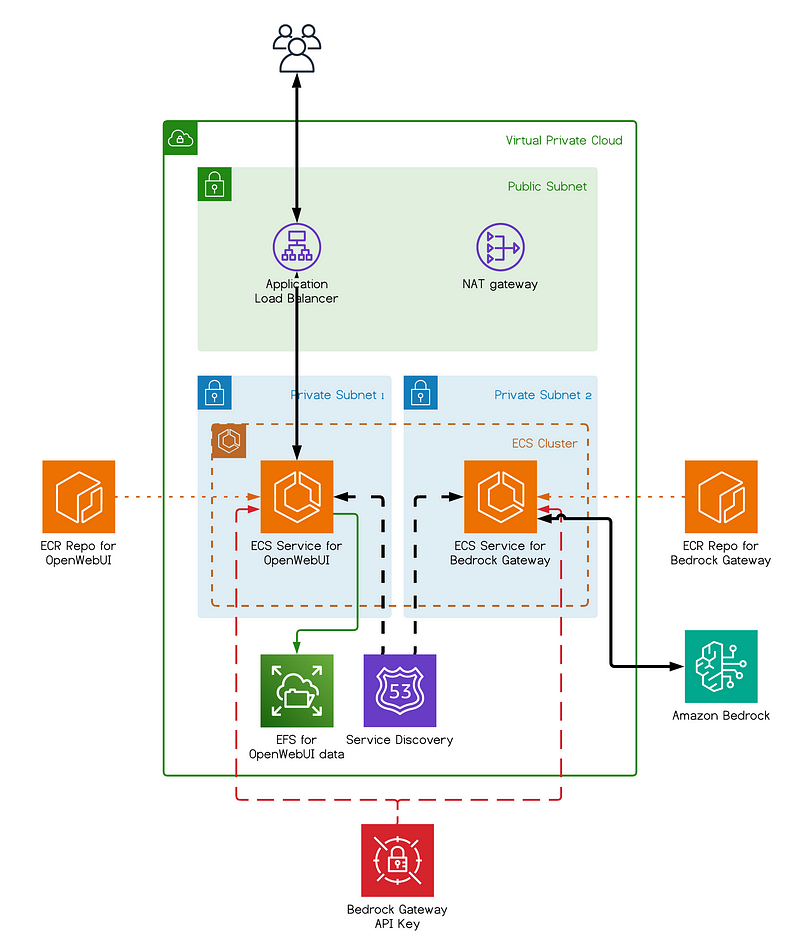
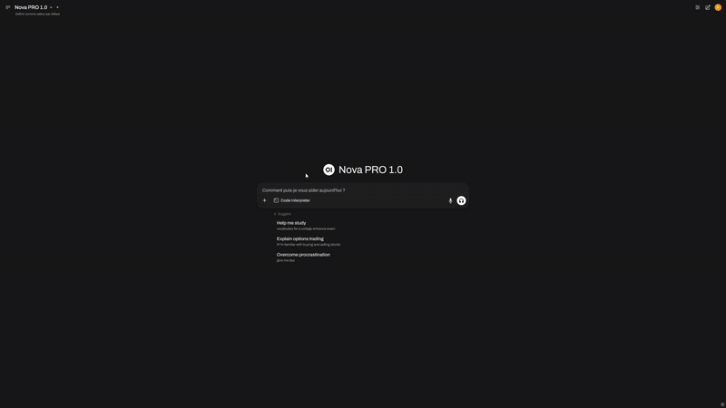

<div align="center">

# AWS Bedrock Chatbot

**A self-hosted generative AI assistant powered by Amazon Bedrock.**

Open WebUI · Bedrock Access Gateway · MCP tools — fully containerized and deployed on AWS ECS Fargate using Terraform.

[](https://www.terraform.io/)
[](https://aws.amazon.com/fargate/)
[](https://aws.amazon.com/bedrock/)

📖 Read the companion article on [Medium](https://medium.com/@joshuakim408/deploying-your-own-ai-agent-with-amazon-bedrock-15b3e8fd6c39)

</div>

---

## Overview

This repository provides everything you need to deploy a complete, private generative AI chatbot directly into your own AWS environment. It combines a highly polished, ChatGPT-style web interface with the powerful foundation models available in Amazon Bedrock (such as Claude and Titan). 

The best part? You don't have to write a single line of application code. The entire infrastructure is defined as Code using Terraform and runs securely as serverless containers on AWS ECS Fargate.





> [!NOTE]
> This project is designed as a **proof of concept and starting point**. The default configuration prioritizes a fast, low-friction deployment over strict production hardening. Please review the [Security notes](#security-notes) before exposing this application to the public internet.

## Features

- 🧱 **Amazon Bedrock Integration** — Native access to industry-leading foundation models like Claude, Titan, and more.
- 💬 **[Open WebUI](https://github.com/open-webui/open-webui)** — A sleek, modern, and highly responsive chat interface.
- 🔁 **[Bedrock Access Gateway](https://github.com/aws-samples/bedrock-access-gateway)** — Acts as a universal API translator, allowing OpenAI-compatible apps to speak to Bedrock seamlessly.
- 🔌 **[MCPO](https://github.com/open-webui/mcpo)** — Exposes Model Context Protocol (MCP) servers (like time, GitLab, Linear, etc.) directly to the UI as usable tools.
- ☁️ **ECS Fargate (ARM64)** — A completely serverless container architecture, meaning no EC2 instances to manage or patch.
- 🔒 **Batteries Included** — Automatically provisions your VPC, Application Load Balancer, EFS storage, S3 buckets, Secrets Manager, IAM roles, and optional custom domains/VPC endpoints.


## Architecture

Here is a breakdown of the core components deployed in this stack:

| Component | Role |
| --- | --- |
| **Application Load Balancer** | Your public entry point (serves HTTP, or HTTPS if you configure a custom domain). |
| **Open WebUI** | The main chat interface hosted on ECS Fargate (in a private subnet). User data persists on **EFS**, and file uploads go to **S3**. |
| **Bedrock Access Gateway** | Translates OpenAI-formatted API calls into Bedrock API calls. Internally routed at `gateway.bedrock.local`. |
| **MCPO** | Serves your external MCP tools over HTTP at `mcpo.bedrock.local`. |
| **Cloud Map** | Handles internal, private service discovery (`*.bedrock.local`) so the containers can securely talk to each other. |
| **Secrets Manager** | Securely stores API keys and third-party authentication tokens. |
| **S3** | Stores remote Terraform state (with native locking) and handles user uploads from the chat interface. |

## Prerequisites

Before deploying, ensure you have the following ready:

- An **AWS account** with [Bedrock model access](https://docs.aws.amazon.com/bedrock/latest/userguide/model-access.html) explicitly enabled for the models you want to use.
- The **AWS CLI** installed and configured with a valid named profile.
- **Docker** running locally (Terraform will build and push the container images to ECR during the `apply` phase).
- **Terraform** version `>= 1.11.0` installed.

## Quick Start

Let's get the infrastructure up and running:

```bash
git clone https://github.com/hakimizz-tech/aws-bedrock-chatbot-agent.git
cd aws-bedrock-chatbot

# 1. Configure your environment (AWS account, region, profile)
cp terraform.tfvars.example terraform.tfvars
$EDITOR terraform.tfvars

# 2. Deploy
./deploy.sh
```

The `deploy.sh` script is just a convenient wrapper around our Makefile. If you prefer to run the steps manually, you can execute:

```bash
make setup-state   # One-time setup: creates the S3 bucket for remote Terraform state
make init          # Initializes Terraform and configures the S3 backend
make apply         # Clones sources, builds/pushes Docker images, and deploys the AWS stack
```

Once the deployment finishes successfully, grab your new endpoint URL and open it in your browser:

```bash
make output
```

*Note: On your first visit to the UI, you will need to register an admin account to start chatting with the Bedrock models.*

> **Behind the scenes:** The Terraform run will automatically clone the necessary Open WebUI and Bedrock Access Gateway repositories and raise the Node build memory limits for the Open WebUI image—you do not need to intervene manually.

## Configuration

All customizable inputs are managed inside `terraform.tfvars` (use `terraform.tfvars.example` as a template).

| Variable | Default | Description |
| --- | --- | --- |
| `account_id` | — | Your 12-digit AWS account ID. |
| `region` | `eu-west-1` | The AWS region where you want to deploy the stack. |
| `profile` | — | The AWS CLI profile to authenticate with. |
| `domain_name` | `null` | Your custom domain name (Required if `enable_domain` is set to `true`). |
| `feature_toggles.enable_domain` | `false` | Provisions an ACM certificate and serves traffic securely over HTTPS via the ALB. **Requires** a `domain_name`, an existing Route 53 hosted zone, and a DNS record pointing the domain to the ALB (found via `make output`). |
| `feature_toggles.enable_vpc_endpoints` | `false` | Provisions interface VPC endpoints (for Bedrock, ECR, Secrets Manager, CloudWatch Logs, etc.) to keep all traffic entirely private on the AWS backbone. |

*Note: Specific model and source versions for Open WebUI and Bedrock Access Gateway are pinned in [`variables.tf`](variables.tf) for stability.*

### MCPO Third-Party Tokens

If you are using MCPO, it ships with integrations for GitLab and Linear MCP servers. During deployment, placeholder tokens (`REPLACE_ME`) are created in AWS Secrets Manager just so the services can boot up successfully. 

You will need to update these with your actual tokens after the first deployment. Terraform will safely ignore these secrets on future runs so it doesn't overwrite your real keys:

```bash
aws secretsmanager put-secret-value --secret-id <gitlab-token-...> --secret-string "<your-gitlab-pat>"
aws secretsmanager put-secret-value --secret-id <linear-token-...> --secret-string "<your-linear-key>"
```

## Security Notes

**This setup is a Proof of Concept (POC). Please review the following before exposing it to the public:**

- **No TLS without a Custom Domain:** If `enable_domain = false`, the application is served over plain, unencrypted **HTTP**.
- **Open Registration:** By default, anyone who finds your load balancer URL can register an account and use your Bedrock models.
- **Broad IAM Permissions:** To ensure a smooth initial deployment, the ECS task roles use relatively permissive policies (e.g., `bedrock:*`, `s3:*`).

**For Production Environments:** You should absolutely enable a custom domain to enforce HTTPS, restrict ALB access using an AWS WAF or Security Group IP allow-listing, disable open sign-ups in Open WebUI, and strictly scope down the IAM policies to least privilege.

## Teardown

If you want to spin down the infrastructure and stop incurring AWS charges:

```bash
make destroy   # Tears down the entire AWS application stack
make clean     # Cleans up locally cloned sources and Terraform cache files
```

*Note: The remote state S3 bucket created by `make setup-state` is **not** deleted by `make destroy` to prevent accidental state loss. You must delete this bucket manually via the AWS Console or CLI if you want a complete wipe of the environment.*

## Troubleshooting

- **Open WebUI build runs out of memory:** The Node build memory limit is raised automatically in the scripts. However, if it still fails on your local machine, you likely need to allocate more RAM to your Docker Desktop daemon settings.
- **MCPO tools fail to authenticate:** Double-check that you replaced the `REPLACE_ME` placeholder tokens in AWS Secrets Manager with your actual third-party API keys (see the MCPO section above).
